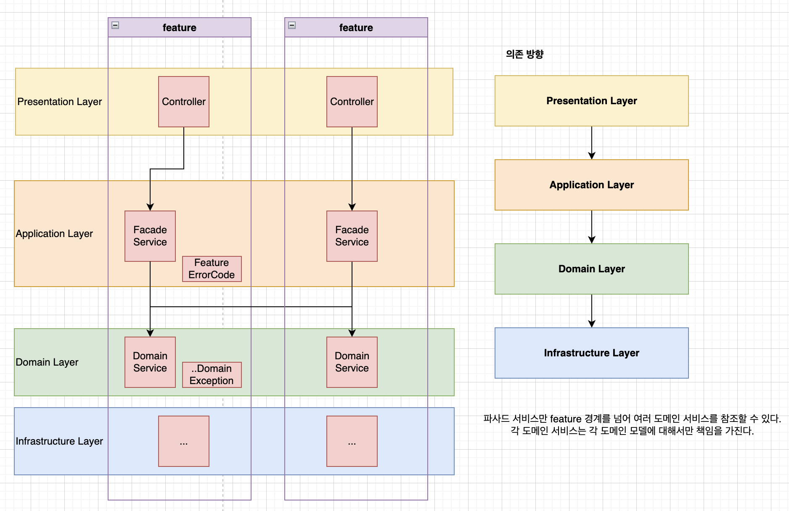

# spring-security-jwt-ssongplate

본 프로젝트는 `Java 21`, `Spring Boot 3.x` 기준으로 개발하였습니다.<br/>
`Spring Security` + `JWT`를 활용한 인증 인가 템플릿입니다.<br/>
`flyway` DB 마이그레이션 도구를 사용합니다.<br/>
소프트웨어 아키텍처로 `레이어드 아키텍처`를 사용합니다.



## 액세스 토큰, 리프레시 토큰 비대칭키 생성
### openssl 명령어를 이용하여 비대칭키 생성
아래 명령어은 비대칭키를 생성하는 명령어 예시입니다.

#### 개인키 생성
```bash
openssl genrsa -out {원하는개인키파일명} 2048
```
#### 비대칭키를 이용해 공개키 생성
```bash
openssl rsa -in {개인키파일명} -out {원하는공개키명}.pub -pubout
```
액세스 토큰용, 리프레시 토큰용으로 비대칭키 2쌍 생성이 필요합니다.
액세스 토큰용은 `accessKey` 라는 파일명으로, 리프레시 토큰용은 `refreshKey`라는 파일명으로 생성합니다.

그리고 `resources/secret` 디렉토리 하위에 위치시킵니다.

## Gradle Build
```bash
./gradlew clean bootJar
```
## Java Run
```bash
java -Dserver.port=8080 -jar build/libs/jwt-0.0.1-SNAPSHOT.jar
```
## Swagger 접속
```
http://localhost:8080/docs/swagger-ui/index.html
```
### openapi spec 추출
```
http://localhost:8080/docs
```

## 일반 유저 등록 API
```
POST /api/v1/members
```
### request
```
{
    username: String,
    password: String,
    nickname: String
}
```
* `ROLE_MEMBER` 권한을 부여하여 `Account` 생성
* 리프레시 토큰의 초기 가중치는 1로 설정

## 계정 인증 API
```
POST /api/v1/accounts/token
```
### request
```
{
    username: String,
    password: String,
}
```
* `username`과 `password`를 통해 계정 인증
* 해당 사용자 권한으로 액세스토큰 리프레시 토큰 반환
  * 리프레시 토큰 Http Only, Secure 쿠키 추가

## 액세스 토큰, 리프레시 토큰 갱신 API
```
PUT /api/v1/accounts/token
```
### request header
```
RT: String
```
* 리프레시 토큰을 검증(유효성, 리프레시 토큰 가중치)
* 액세스 토큰 발급

## 리프레시 토큰 무효화 API
호출자의 `ROLE_ADMIN` 권한 보유여부 확인
```
DELETE /api/v1/accounts/{accountId}/token
```
* 토큰 버저닝 방식으로 해당 `accountId`의 토큰 가중치를 1 증가시킴으로써 이전에 발급된 해당 `accountId`에 대한 모든 리프레시 토큰 무효화

